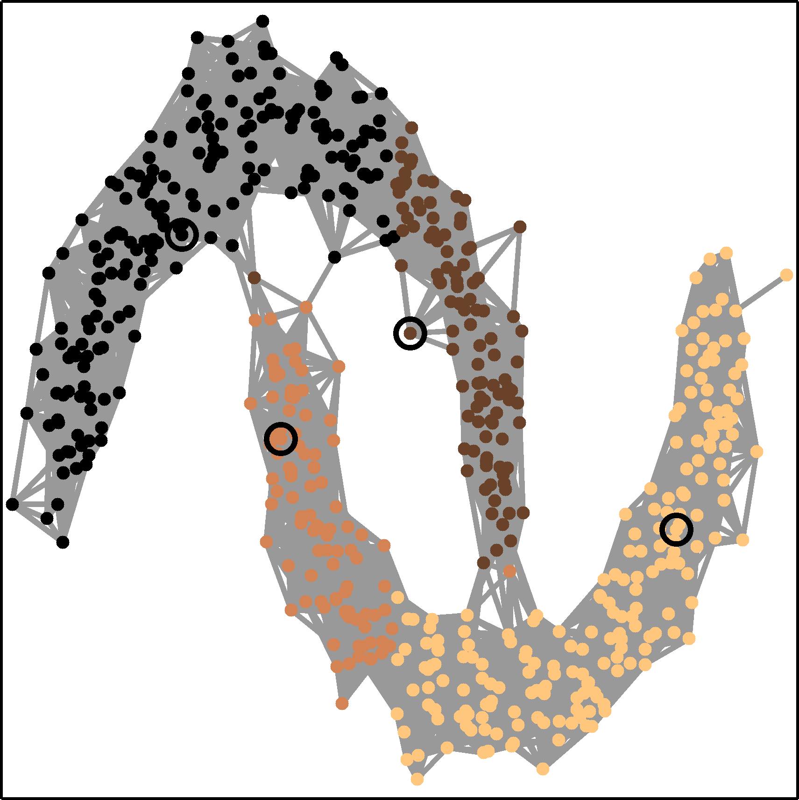
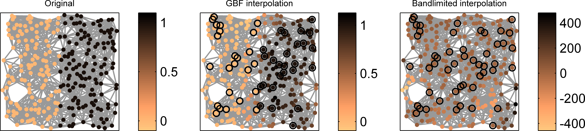
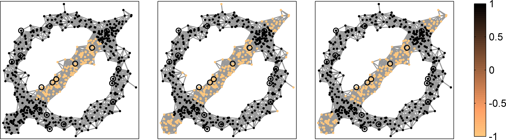

# GBFlearn - Learning with Graph Basis Functions

A very simple toolbox to illustrate how graph basis functions (GBFs) can be used for interpolation, classification and semi-supervised learning on graphs.
--------------------------------------------------------------------------------

 
 

Version: 0.1 (01.03.2020)

Written by <a href="http://www.lissajous.it"> Wolfgang Erb</a>

General Description
-------------------

**GBFlearn** is a simple Matlab toolbox for interpolation, regression, and semi-supervised learning with graph basis functions.

Graph basis functions (GBFs) are graph analogs of the well-known radial basis functions or the spherical basis functions. Generalized shifts of positive definite GBFs generate kernels on graphs that can be used, as in traditional continuous settings, to approximate and interpolate graph signals, or as kernel machines for supervised and semi-supervised learning.  

An introduction to GBFs explaining the relation to kernel methods on graphs is given in [1]. Applications of GBFs to machine learning on graphs can be found in [2]. A short <a href="http://www.lissajous.it"> tutorial</a> and further information can be found at 
<a href="http://www.lissajous.it"> www.lissajous.it</a>.

 

 
Fig. 1 Comparison of GBF interpolation with bandlimited interpolation on a sensor graph. 

Description of the Code
-----------------------

The package contains three main parts

- The main *Matlab* folder contains example scripts and demos on how to use GBFs for the interpolation, regression and classification of graph signals. 

- The subfolder *./core* contains the core code of the package for the generation of the different graphs, the basis functions and the plots. 

- The subfolder *./data* contains several *.mat* files with the node information of the example graphs. 

The example scripts can be divided into two categories:

- The files of the form **GBF_example_ITP_(graph).m** are used to demonstrate how GBFs can be used for the interpolation of graph signals and how GBFs compare to bandlimited interpolation.  

- In the scripts of the form **GBF_example_SSL_(graph).m** supervised and semi-supervised classification based on feature-augmented GBF-kernels is tested on several data sets. 

 
Fig. 2 Classification with supervised (left) and semi-supervised (middle and right) kernel-based methods on the slashed-O data set. 

Remarks
--------------------

The main purpose of this code is to see how GBFs can be used for the interpolation of graph signals, or in supervised and semi-supervised classification on graphs. The calculations rely heavily on the graph Fourier transform and are therefore quite expensive if larger spectral decompositions have to be calculated. I wrote the code mainly for didactical purposes and didn't optimize it for speed. Therefore, some of the computations might be quite slow for larger graphs. 

Anybody interested in accelerating or refining the actual code is warmly welcome to contribute. The same holds true if anybody is interested in adding new examples or analysis tools. Please contact me (www.lissajous.it) if you need further information. 

Citation and Credits
--------------------

This code was written by Wolfgang Erb at the Dipartimento di Matematica ''Tullio Levi-Civita'', University of Padova. The corresponding theory on GBFs related to the interpolation of graph signals and to kernel-based learning is given in  

*   [1] &nbsp; Erb, W.  
    <i> Graph Signal Interpolation with Positive Definite Graph Basis Functions </i>  
    arXiv:1912.02069 [eess.SP] (2019) 

*   [2] &nbsp; Erb, W.  
    <i> Semi-Supervised Learning on Graphs with Feature-Augmented Graph Basis Functions  </i>  
    arXiv:2003.07646  [cs.LG] (2020) 

 
Source for the Stanford bunny: Stanford
University Computer Graphics Laboratory.  
Source for the ionosphere data and the Wisconsin Breast Cancer data set: UCI machine learning repository

License
-------

Copyright (C) 2020 Wolfgang Erb

GBFlearn is free software: you can redistribute it and/or modify
it under the terms of the GNU General Public License as published by
the Free Software Foundation, either version 3 of the License, or
(at your option) any later version.

This program is distributed in the hope that it will be useful,
but WITHOUT ANY WARRANTY; without even the implied warranty of
MERCHANTABILITY or FITNESS FOR A PARTICULAR PURPOSE.  See the
GNU General Public License for more details.

You should have received a copy of the GNU General Public License
along with this program. If not, see <http://www.gnu.org/licenses/>.
